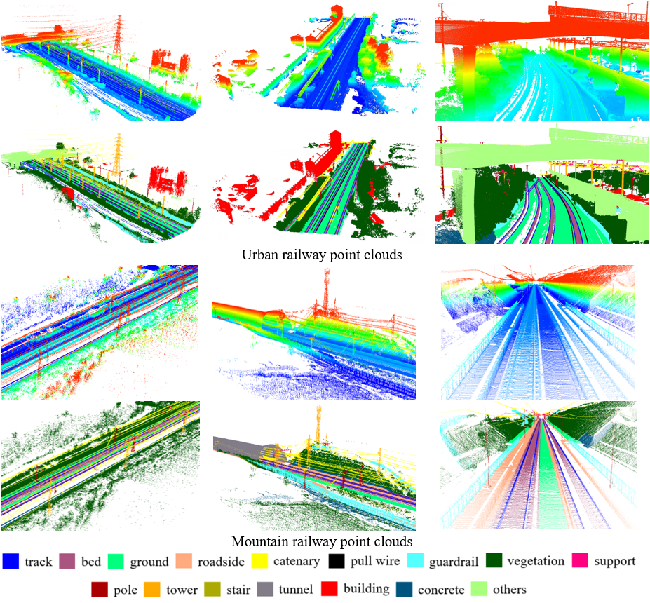

# RailPC: 大规模铁路点云语义分割数据集

这是**RailPC**数据集的官方库。详情请参考: 
**RailPC: 大规模铁路点云语义分割数据集**  
Tengping Jiang, Shiwei Li, Qinyu Zhang, Guangshuai Wang, Zequn Zhang, Fankun Zeng, Peng An, Xin Jin, Shan Liu, Yongjun Wang. 

铁路场景三维点云的语义分割具有重要的经济价值，但由于缺乏合适的数据集，其发展受到严重阻碍。此外，在现有城市道路点云数据集上训练的模型在铁路数据上的泛化能力较差，
原因是特殊/稀有类别（如铁轨、轨枕等）的缺失造成了巨大的跨域差距。为了发挥监督学习方法在三维铁路语义分割领域的潜力，引入了新的点云基准--RailPC。
RailPC 为铁路场景中的语义分割提供了一个具有丰富注释的大规模数据集。值得注意的是，与现有最大的移动激光扫描（MLS）点云数据集相比，RailPC 包含两倍数量的注释点，
是首个用于语义分割的铁路专用三维数据集。它覆盖了两个不同场景（城市和山地）中总长近 25 公里的铁路，拥有 30 亿个点，这些点被精细标注为铁路最典型的 16 个类别，
数据采集过程由 MLS 系统完成。通过大量实验评估了高级场景理解方法在标注数据集上的性能，并对语义分割结果进行了合成分析。基于研究结果确定了铁路尺度点云语义分割面临的一些关键挑战。

## 样例

https://github.com/NNU-GISA/GISA-RailPC/assets/40690061/5b60a97f-2205-40ea-9d05-afb30e70efcc

## 下载
如果您想申请该数据集，请按以下格式填写信息，并通过电子邮件发送至 211345003@njnu.edu.cn 或 221302177@njnu.edu.cn。我们会尽快给您回复。  
  
	主题：请求提供 RailPC 数据集  
 
    ******** 基本信息 ********
    · 姓名:
    · 电子邮件:
    · 所属单位:
    · 联系电话:
    
    ******** 研究背景 ********
    · 研究领域/方向:
    · 您计划如何使用数据集？（例如学术研究、商务分析、课程项目等）：:
    · 您是否愿意在您的研究成果中引用或参考该数据集及其来源:
    · 您对该数据集的建议（可选）:
    
## 数据集

### 总览

所提出的基准称为 RailPC 数据集，它包括从两种不同环境（即城市和山区铁路场景）收集的 20 多亿个三维点。城市铁路采集的是中国南京的一段铁路，全长约 10 公里。
至于山区铁路环境的数据、数据采集于成都的农村铁路货场区域。山区铁路点云覆盖道路长度约 15 公里，位于相对高海拔地区。

  

图 1. RailPC 数据集覆盖区域概览。
 

### 数据收集

MLS 系统配备有 360° 视场的 HiScan-C 扫描传感器、 
结构光模块、实时运动学 (RTK) 全球导航卫星系统 (GNSS)、 
嵌入式计算机和供电系统。安装的激光传感器的探测范围为 0.5 米至 119 米、 
精度约为 2 毫米，每秒生成 1,000,000 个点。
垂直方向的均方根精度约为 0.04 米，水平方向约为 0.02 米、 
航向精度为 0.015◦，俯仰和滚动精度为 0.008◦。

### 语义标注

  

图 2. RailPC 数据集示例。不同的语义类别用不同的颜色标注。
 

- **铁轨**
- **轨枕** (枕木和道碴)
- **地面**(表面和崎岖地形)
- **路沿**
- **导线** (输电和配电线路)
- **引线**
- **护栏** (围栏和铁路障碍物)
- **植被** (树木和草地)
- **支架** (承力索和定位管)
- **杆** (电线杆和灯杆)
- **输电塔**
- **楼梯**
- **隧道**
- **建筑** (住宅、高层建筑和仓库)
- **混凝土**
- **其他** (其余对象)
- **噪点** (可删除)

### 数据统计

  

图 3. RailPC 数据集中不同语义类别的分布情况。
 

## 更新日历
* 2024/04/23: 数据集可供下载！
* 2024/04/18: 首次发布！
* 2024/03/13: CAAI已接受RailPC！

## 下一步计划
- [x] 山区铁路场景语义分割数据集！
- [x] 城市铁路场景语义分割数据集！
- [ ] 铁路场景实例分割数据集！
- [ ] 铁路场景全景分割数据集！

## 相关库
1. [SPGraph:Large-scale Point Cloud Semantic Segmentation with Superpoint Graphs](https://github.com/loicland/superpoint_graph)
2. [KPConv: Flexible and deformable convolution for point clouds](https://github.com/HuguesTHOMAS/KPConv)
3. [RandLA-Net: Efficient Semantic Segmentation of Large-Scale Point Clouds](https://github.com/QingyongHu/RandLA-Net) 
4. [SQN: Weakly-Supervised Semantic Segmentation of Large-Scale 3D Point Clouds](https://github.com/QingyongHu/SQN) 
 
