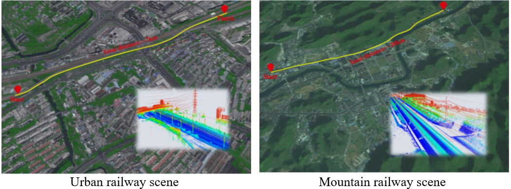
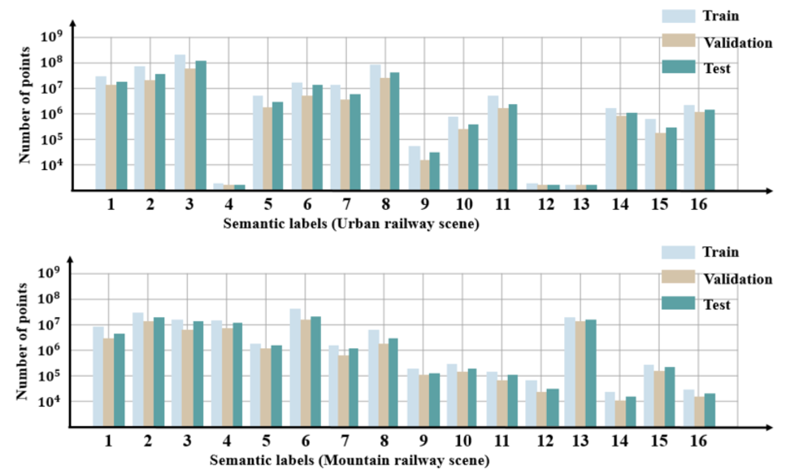

# Rail3D: A Large-Scale Mobile LiDAR Point Cloud Dataset for Semantic Segmentation of Railway Scenes

This is the official repository of the **RailPC** dataset. For details, please refer to:

**Rail3D: A Large-Scale Mobile LiDAR Point Cloud Dataset for Semantic Segmentation of Railway Scenes**  
Tengping Jiang, Lei Dai, Shiwei Li, Qinyu Zhang, Zequn Zhang, Fankun Zeng, Yangzi Cong, Yongjun Wang, Xin Jin, Peng An. 
**[[Paper]
]**  

Fine-grained scene understanding in the context of 3D point clouds for the railway environment carries enormous economic values, 
but its development is severely limited by the lack of suitable and specific datasets. 
Besides, the models trained on existing urban road point cloud datasets exhibit poor generalization on railway data because of a large domain gap caused by non-overlapped special/rare categories,
e.g., rail track, track bed, etc. To unleash the potential of supervised deep learning algorithms in the area of 3D railway scene understanding, 
we present a new point cloud benchmark, dubbed Rail3D, with large-scale richly annotated points for semantic segmentation in the railway environment. 
Specifically, Rail3D has not only 2 times the number of labeled points of the existing largest mobile laser scanning (MLS) point cloud dataset, 
but also is the first railway-specific 3D dataset for semantic segmentation. It covers a total of nearly 25 km railway in two different scenes (urban and mountain), 
with 3 billion points that are finely labeled as 11 most typical classes w.r.t railway, and the data acquisition process is completed in China by MLS systems. 
Experimentally, we extensively evaluate the performance of state-of-the-art scene understanding algorithms on our dataset and provide a comprehensive analysis of the results. 
Based on that, we identify several key challenges towards railway-scale point cloud understanding. We will release our dataset upon paper acceptance and continually update it with usage feedback from the community.

## Dataset

#### 1.1 Overview

The proposed benchmark called the Rail3D dataset, it comprises over 3 billion 3D points collected from two different environments (i.e., urban and mountain railway scenes). 
The urban railway was captured a section of Nanjing, China, covering road length of approximately 10 km. The dataset of section of Nanjing is comparable to street roadway dataset in several aspects, 
they are both urban outdoor large-scale scenes collected by a vehicle-mounted MLS system.

  

Figure 1. Overview of the world’s railways (Source: OpenRailwayMap)
 

#### 1.2 Data Collection

The MLS system is equipped with a HiScan-C scanning sensor with 360° field of view, 
structured light module, a real-time kinematic (RTK) global navigation satellite system (GNSS), 
an embedded computer and a power supply system. The detection range of the installed laser sensor is 0.5 m – 119 m, 
ensuring the accuracy of about 2 mm and generating 1,000,000 points per second. 
The root mean square accuracy is about 0.04 m in a vertical direction, 0.02 m in the horizontal direction, 
0.015◦ in the heading direction, and 0.008◦ in pitch and roll directions. 

#### 1.3 Semantic Annotations

  

Figure 2. Examples of our Rail3D dataset. Different semantic classes are labeled by different colors.
 

- **Rail track**
- **Track bed** (sleeper and ballast)
- **Catenary** (transmission and distribution lines)
- **Guardrail** (fences and railway barriers)
- **Vegetation** (trees and grass)
- **Pole** (power line poles and light poles)
- **Transmission tower**
- **Ground** (impervious surfaces and rough terrain)
- **Building** (residential, high-rises, and warehouses)
- **Support** (bearing cable and positioning tube)
- **Other** (remaining objects)

#### 1.4 Statistics

  

Figure 3. The distribution of different semantic categories in the Rail3D dataset.
 

## Benchmarks
Five well-known deep learning models were selected as solid baselines to test on the proposed dataset due to their strong performance on similar outdoor point cloud benchmarks   

Table 1. Semantic segmentation results of different methods. Red, blue and green bold numbers represent the best, second and third ranked results, respectively

  

Table 2. Results of different methods trained using only position information

  

## Download

## Demo

### Citation
If you find our work useful in your research, please consider citing:

	@article{rail3d,
  	title={Rail3D: A Large-Scale Mobile LiDAR Point Cloud Dataset for Semantic Segmentation of Railway Scenes},
  	author={Jiang, Tengping and Dai, Lei and Li, Shiwei and Zhang, Qinyu and Zhang, Zequn and Zeng, Fankun and Cong, Yangzi and Wang, Yongjun and Jin, Xin and An, Peng},
  	journal={CAAI Transactions on Intelligence Technology},
  	volume={},
  	number={},
  	pages={},
  	year={2024},
  	publisher={Wiley}

### Updates
* 2024/04/25: The dataset is available for download!
* 2024/04/18: Initial release!
* 2024/03/13: The Rail3D has been accepted by CAAI!

### To do
- [x] Mountain railway scene semantic segmentation dataset！
- [x] Urban railway scene semantic segmentation dataset！
- [ ] Railway scene instance segmentation dataset！
- [ ] Railway scene panoptic segmentation dataset！

## Related Repos
1. [SPGraph:Large-scale Point Cloud Semantic Segmentation with Superpoint Graphs](https://github.com/loicland/superpoint_graph)
2. [KPConv: Flexible and deformable convolution for point clouds](https://github.com/HuguesTHOMAS/KPConv)
3. [RandLA-Net: Efficient Semantic Segmentation of Large-Scale Point Clouds](https://github.com/QingyongHu/RandLA-Net) 
4. [SQN: Weakly-Supervised Semantic Segmentation of Large-Scale 3D Point Clouds](https://github.com/QingyongHu/SQN) 
